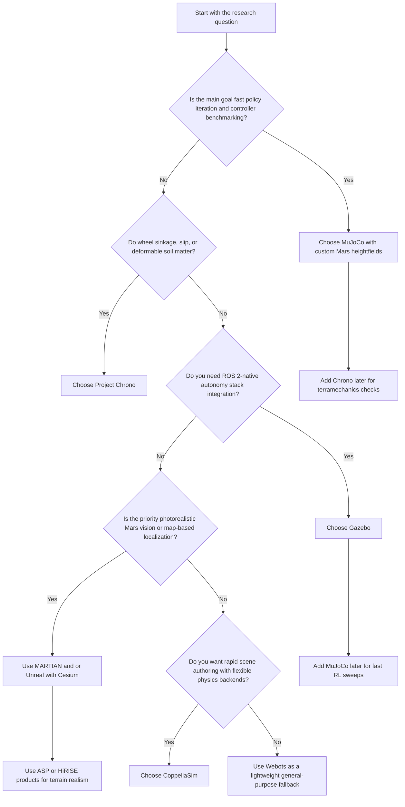

# Mars Robotics Simulation Platforms and Closely Related Research

## Executive summary

For a MuJoCo-first Mars robotics project, the most practical starting point is **MuJoCo plus custom Mars terrain assets built from HiRISE/CTX/MOLA data**, because MuJoCo gives you fast rigid-body simulation, native Python bindings, MJCF/URDF workflows, macOS binaries, cameras, IMU-style sensing, rangefinder support, and an extensible plugin system with minimal migration away from an RL/control workflow. Its main weakness is that it does **not** provide Mars-specific terramechanics or a native LiDAR-first planetary stack out of the box, so wheel sinkage, regolith deformation, and mission-grade rover trafficability must be approximated or added externally. citeturn12view0turn13view4turn21view0turn21view1turn14view0

If your main research question is **navigation policy comparison** rather than soil mechanics, the literature most directly relevant to your project is the JPL line around **ACE, ENav, and MLNav**: these papers study safe rover path evaluation, heuristic/path-ranking improvements for Perseverance’s Enhanced AutoNav, and learning-assisted search over real Martian terrain and challenging synthetic terrain. The key result pattern is consistent: learned components can meaningfully reduce safety-check workload or search cost while preserving safety constraints, and in MLNav’s case the authors report roughly a **10× reduction in collision checks** versus the ENav baseline on real Martian terrain data. citeturn46academia2turn46academia3turn46academia0

If your question expands from navigation into **locomotion over deformable Mars-like soil**, **Project Chrono** is the strongest research platform in this comparison. Official Chrono documentation exposes rigid terrain plus deformable **SCM, DEM, FEA, and CRM/SPH** terrain models, and its sensor stack supports cameras, LiDAR, GPS, and IMU-like sensing with ROS 2 and Python APIs. Recent Chrono papers also validate extraterrestrial terramechanics models against physical experiments and rover hardware, which is exactly the kind of evidence you want if “Mars-like” must mean more than a textured heightfield. citeturn16view1turn17view0turn17view1turn17view2turn17view3turn50view1turn34academia0turn34academia1

For **ROS-native systems integration**, **Gazebo Harmonic/Jetty** is the safest complementary platform: official docs emphasize high-fidelity physics, rendering, sensors with noise models, plugins, SDF worlds, and extensive ROS 2 integration. It is not Mars-specific, but it is very good for autonomy-stack testing once you want planners, Nav2-style middleware, sensor topics, or multi-process robotics architecture around your rover model. citeturn19view3turn19view1turn13view2

For **vision-heavy Mars simulation**, especially aerial or map-based localization, the best supporting tools are **MARTIAN** and the **NASA Ames Stereo Pipeline** rather than a full vehicle simulator. MARTIAN is a NASA JPL Blender-based framework that imports **HiRISE DTMs and orthoimages** to generate Mars aerial observations under controllable lighting, while Ames Stereo Pipeline is NASA Ames’ open-source terrain-generation stack for planetary imagery and already supports Mars rover and orbital cartography workflows. These are especially valuable if your later phases need realistic Mars datasets, DEM generation, or photometrically varied navigation imagery. citeturn36view0turn49academia3turn26view0turn26view2

My overall recommendation is a **stacked approach**, not a single winner: **MuJoCo** for fast policy iteration and benchmark development, **Chrono** for a higher-fidelity terramechanics check, **Gazebo** for ROS 2 systems testing, and **MARTIAN / ASP** for terrain and vision realism. That combination best matches a project whose baseline research question is learned-versus-classical traversal, but which may later need stronger sensor realism or physics fidelity. citeturn12view0turn16view1turn19view3turn36view0turn26view0

## Assumptions and scope

I assumed the immediate goal is **research prototyping before project implementation**, with **no budget constraint**, **no fixed robot morphology**, and a likely desire to preserve a **MuJoCo/Python-centric workflow** for RL and controller experiments. I also assumed that “similar problems” includes three classes of prior work: rover **navigation**, rover **control/locomotion on Mars-like or extraterrestrial terrain**, and **vision-based localization** using Mars terrain simulation.

A key terminology note: in the retrieved literature, **ENav** is described as **Enhanced AutoNav**, the Perseverance rover’s surface navigation software and baseline planner, not as a separately documented public simulator package. The papers I found describe ENav being evaluated in high-fidelity simulation and on real Martian terrain products, but I did **not** find official public documentation for a standalone “ENav Sim” release during this pass. I therefore treat ENav as a **navigation software baseline** rather than a publicly documented simulation platform. citeturn44academia0turn44academia1

I also separated **vehicle dynamics simulators** from **terrain/vision data pipelines**. That matters here because several of the most useful Mars tools are not full robotics simulators: **Ames Stereo Pipeline** is for terrain generation and map products, and **MARTIAN** is for synthetic Mars imagery generation from real orbital terrain data. Both are extremely useful, but neither replaces MuJoCo, Gazebo, or Chrono as a closed-loop vehicle simulator. citeturn26view0turn36view0

## Closely related research papers

The table below prioritizes papers that are directly useful for your project design. Where the retrieved source did **not** let me verify final peer-reviewed venue details, I label the item conservatively as a **public preprint/technical paper** rather than overstating publication status.

| Paper | Retrieved publication status | Abstract summary and problem addressed | Methods | Simulator or environment used | Key results | Code or data |
|---|---|---|---|---|---|---|
| **K. Otsu et al., “Fast Approximate Clearance Evaluation for Rovers with Articulated Suspension Systems”** citeturn46academia2 | Public preprint; Mars 2020/JPL mission paper | Introduces **ACE**, a conservative, fast clearance-evaluation method for a Mars rover with articulated suspension, targeting the computational bottleneck in safe onboard path planning on rough terrain. citeturn46academia2 | Conservative bounds on wheel heights, rover attitude, suspension angles, and body clearance without iterative nonlinear solve. citeturn46academia2 | High-fidelity rover safety evaluation in Mars 2020-style path planning; standalone simulator name not stated in retrieved abstract. citeturn46academia2 | Reports fast computation with conservative safety guarantees, intended for the Mars 2020 rover path planner. citeturn46academia2 | No public code/data link identified in retrieved source. |
| **N. Abcouwer et al., “Machine Learning Based Path Planning for Improved Rover Navigation”** citeturn46academia3 | Public preprint; explicitly framed around **ENav** | Targets the path-ranking bottleneck in **Enhanced AutoNav** by improving which candidate paths reach ACE first, instead of replacing safety checks entirely. citeturn46academia3 | Sobel/convolution heuristic plus ML-based traversability prediction learned from simulation data; Monte Carlo evaluation across slopes and rock fields. citeturn46academia3 | Physics simulations used for training-data generation and Monte Carlo validation over Mars-like terrains. citeturn46academia3 | Reduced ACE evaluations and computation time while maintaining or improving success and path efficiency relative to baseline ENav. citeturn46academia3 | No public code identified. |
| **S. Daftry et al., “MLNav: Learning to Safely Navigate on Martian Terrains”** citeturn46academia0 | Public preprint; strongest directly relevant ENav-adjacent paper retrieved | Replaces expensive search ordering in rover navigation with a learned heuristic that still respects model-based safety checking; highly relevant to any learned-vs-planned Mars benchmark. citeturn46academia0 | Learning-enhanced path planning with a learned feasibility heuristic, while retaining model-based safety checker calls on top-ranked candidates. citeturn46academia0 | High-fidelity simulation using **real Perseverance Martian terrain data** plus synthetic terrains; ENav used as baseline. citeturn46academia0 | Authors report about a **10× reduction in collision checks** on real Martian terrain and success on difficult terrains where ENav times out. citeturn46academia0 | No public code identified in retrieved source. |
| **M. Azkarate et al., “A GNC Architecture for Planetary Rovers with Autonomous Navigation Capabilities”** citeturn46academia1 | Public preprint / technical paper | Proposes a two-level guidance, navigation, and control architecture for long-range, low-supervision planetary rover traverses. citeturn46academia1 | Lower layer for efficient AutoNav-style functions; upper layer uses adaptive SLAM, traversability analysis, and global localization to correct drift. citeturn46academia1 | The retrieved abstract emphasizes **planetary analogue field-test campaigns**; simulator not specified in the retrieved abstract. citeturn46academia1 | Architecture validated in analogue campaigns and designed for Mars 2020 / Sample Fetch Rover–type conditions. citeturn46academia1 | No code/data link identified. |
| **W. Hu et al., “Using physics-based simulation towards eliminating empiricism in extraterrestrial terramechanics applications”** citeturn34academia0 | Public preprint / technical paper | Argues that low-gravity rover terramechanics cannot be trusted if tested with naive gravity-offset assumptions; useful if your work may later claim Mars-likeness in mobility. citeturn34academia0 | Physics-based low-gravity terramechanics simulation tied to revised scaling-law arguments and comparison with physical SLOPE-lab results for rover prototypes. citeturn34academia0 | Newly developed extraterrestrial terramechanics simulator; correlated with NASA Glenn SLOPE lab tests. citeturn34academia0 | Open-sourced simulator reported by authors; supports principled mobility and trafficability studies beyond empirical offset testing. citeturn34academia0 | Public code reported, but URL not identified in retrieved snippet. |
| **H. Unjhawala et al., “A Physics-Based Continuum Model for Versatile, Scalable, and Fast Terramechanics Simulation”** citeturn34academia1 | Public preprint / technical paper | Presents **Chrono::CRM**, a GPU-accelerated SPH terramechanics model meant to go beyond semi-empirical Bekker/Wong-style approximations. citeturn34academia1 | SPH-based continuum terramechanics for deformable terrain, digging, and wheel–soil interaction, benchmarked against DEM and experimental data. citeturn34academia1 | **Project Chrono / Chrono::CRM**. citeturn34academia1turn16view1 | Validated against three physical tests, including one involving NASA’s **MGRU3** rover; authors report near-interactive large-scale simulation performance. citeturn34academia1 | Public GitHub repository reported by authors; exact URL not surfaced in retrieved snippet. |
| **A. Bouton et al., “Learning All-Terrain Locomotion for a Planetary Rover with Actively Articulated Suspension”** citeturn33academia1 | Recent public preprint | Directly relevant to **learned locomotion/control** for a planetary rover over mixed rough and sandy terrain, including sim-to-real transfer. citeturn33academia1 | Reinforcement learning with terrain-specialized policies consolidated into one controller; stereo-derived sparse terrain elevation plus proprioception and force/torque sensing. citeturn33academia1 | **DARTS** high-fidelity simulation engine with rigid contact plus **Bekker-Wong terramechanics**. citeturn33academia1 | Zero-shot transfer to hardware; on a 20° sandy slope, the learned controller reduced **cost of transport by 37%** on dry sand and outperformed passive suspension on wet sand. citeturn33academia1 | No public code link identified in retrieved source. |
| **D. Pisanti et al., “Vision-based Geo-Localization of Future Mars Rotorcraft in Challenging Illumination Conditions”** citeturn49academia1 | Public preprint | Extends the Mars-navigation literature beyond rovers into **map-based localization** for future helicopters, especially under large lighting changes. citeturn49academia1 | Geometry-aided deep image registration model, Geo-LoFTR, trained with synthetic Mars imagery. citeturn49academia1 | Custom Mars simulation framework using real orbital maps; later formalized publicly as **MARTIAN**. citeturn49academia1turn36view0 | Outperformed prior map-based localization approaches under strong illumination and scale variation, across a simulated Martian day. citeturn49academia1 | MARTIAN code repo is public. citeturn36view0 |
| **D. Pisanti and G. Georgakis, “MARTIAN: A Rendering Framework for Aerial Mars Imagery from HiRISE Orbital Data”** citeturn49academia3 | Public preprint + public JPL repo | Introduces an open framework to synthesize Mars aerial views from real **HiRISE** terrain for navigation dataset generation. citeturn49academia3 | Blender-based rendering pipeline importing HiRISE digital terrain models and orthoimages, with controllable illumination and camera parameters. citeturn36view0 | **MARTIAN**, a Blender/Python framework rather than a full rigid-body rover simulator. citeturn36view0 | Validated via concurrent Mars rotorcraft localization work; generates pose-labeled observations from real Martian terrain. citeturn49academia3turn36view0 | Public code: `nasa-jpl/martian`. citeturn36view0 |

### What these papers imply for your project

The strongest directly relevant precedent for your thesis is not “end-to-end RL beats A* on Mars,” but something subtler and more useful: **mission teams already use learned components to accelerate or strengthen classical navigation without discarding hard safety checks**. ACE, ENav-heuristic work, and MLNav all sit in that design space. If your project asks whether a locally sensing MuJoCo policy can compete with a globally informed planner, these papers tell you that **safety-constrained hybridization** is the most defensible line of comparison. citeturn46academia2turn46academia3turn46academia0

The second implication is methodological. The retrieved rover-navigation papers repeatedly rely on **high-fidelity simulation plus real Mars terrain products** rather than purely synthetic game-engine scenes. If you want your benchmark to look serious, the evidence strongly favors a workflow where training uses procedural Mars-like terrain, but at least some **held-out evaluation** uses real **HiRISE/CTX/MOLA-derived** terrain. citeturn46academia0turn46academia3turn23view1turn38view0turn23view3

The third implication is platform selection. If you stay in MuJoCo, you will be well aligned with **fast controller and policy iteration**, but not with the strongest literature on **wheel–soil interaction**. That literature currently points much more toward **Chrono-style terramechanics** and specialized engines such as **DARTS**. citeturn12view0turn16view1turn34academia1turn33academia1

## Comparative table of simulation platforms

Before the table, one important caveat: I did **not** find evidence in this pass for a separate, public, officially documented **ENav simulator product**. The software comparison therefore focuses on public platforms you can actually build on, plus one NASA/JPL support pipeline for terrain/vision generation. citeturn44academia0turn44academia1

| Platform | Physics fidelity | Terrain realism | Sensor models | Real-time performance | Integration with MuJoCo / ROS / Python | Licensing | Community / support | Mars-specific features | Bottom line |
|---|---|---|---|---|---|---|---|---|---|
| **MuJoCo** citeturn12view0turn14view0turn13view4turn21view0turn21view1 | **High for rigid-body contact**; not a terramechanics engine. citeturn12view0 | **Medium** if you import Mars heightfields/meshes yourself. | Camera, depth/distance-style rangefinder, touch, accelerometer, gyro; no built-in LiDAR abstraction found. citeturn13view4turn21view0turn21view1turn21view2turn13view5 | **Excellent** for CPU-based RL/control loops. citeturn12view0turn14view0 | **Excellent Python**, URDF/MJCF-native; ROS integration is not first-party in retrieved docs. citeturn12view0turn14view0 | **Apache 2.0**. citeturn14view0 | Strong docs and active repo. citeturn12view0turn14view0 | No Mars-native terrain or regolith model in retrieved docs. | Best primary platform for your **first benchmark**. |
| **Gazebo with ROS 2** citeturn19view3turn19view1turn13view2 | **High** general robotics fidelity with multiple physics backends. citeturn19view3 | **Medium–High** through SDF worlds, imported meshes, and Gazebo Fuel. citeturn19view3 | Laser range finders, 2D/3D cameras, Kinect-style sensors, contact, force-torque, IMU, GPS, noise models. citeturn19view1 | **Good**, though generally heavier than MuJoCo for fast RL sweeps. *Inference from architecture.* citeturn19view3turn13view2 | **Best ROS 2 support** in this set; Python wrappers exist in repo structure. citeturn13view2turn19view3 | **Apache 2.0**. citeturn19view0 | Large documentation and plugin ecosystem. citeturn13view2turn19view3 | No Mars-specific physics in official docs retrieved. | Best for **systems integration and autonomy-stack testing**. |
| **Project Chrono** citeturn16view1turn17view0turn17view1turn17view2turn17view3turn50view1 | **Very high** for off-road and terramechanics; includes rigid, SCM, DEM, FEA, CRM/SPH terrain. citeturn16view1turn34academia1 | **High** for deformable terrain and large off-road scenarios. citeturn16view1turn34academia1 | RGB, depth, segmentation, normal-map cameras, LiDAR, GPS, IMU; ROS 2 interface. citeturn17view0turn17view1turn17view2turn50view1 | **Moderate** for large scenes; stronger when you truly need terramechanics. citeturn34academia1 | Python and C# APIs, ROS 2 interface, but higher integration overhead than MuJoCo. citeturn17view3turn50view1 | **BSD-3-Clause**. citeturn50view0 | Strong open research community and validation studies. citeturn16view0turn50view1 | Not Mars-branded, but closest fit for **Mars wheel–soil interaction**. | Best high-fidelity choice when **slip/sinkage/regolith matter**. |
| **Webots** citeturn11search2turn42view0turn42view2 | **Medium**; more educational/general-purpose than planetary-specific. citeturn11search2 | **Medium**; custom worlds possible, but no Mars-specific stack. | Broad built-in sensor library and ROS 2 bridge. citeturn11search2turn42view2 | **Good** for rapid prototyping and reproducible examples. citeturn42view1 | Good Python and ROS 2 story; easier than Gazebo for many prototypes. citeturn11search2turn42view2 | **Apache 2.0**. citeturn42view0 | Large open-source community. citeturn42view0 | No Mars-native features retrieved. | Useful fallback if you want a lighter ROS-friendly simulator. |
| **CoppeliaSim** citeturn15view0turn15view2 | **Medium–High** for general robotics, especially because it can use **MuJoCo, Bullet, ODE, Vortex, and Newton**. citeturn15view0 | **Medium**; you can import URDF/SDF/meshes but Mars features are DIY. citeturn15view0 | Vision sensors, proximity sensors, customizable plugins, ROS interfaces. citeturn15view0 | **Good** for interactive prototyping. | Strong for Python/ROS and uniquely attractive if you want a **MuJoCo-backed** scene inside another robotics IDE. citeturn15view0 | Free educational option; source availability and broader licensing details depend on edition. citeturn15view0turn15view2 | Established but smaller research community than Gazebo/Webots. *Inference.* | No Mars-native features retrieved. | Best “bridge” platform if you want **fast authoring plus a MuJoCo backend**. |
| **Unity + Unity Robotics Hub + Cesium for Unity** citeturn40view0turn41view2 | **Medium** for robotics physics in this context; more compelling for visualization and ROS workflow than for terramechanics. citeturn40view0 | **High visual potential**, especially with geospatial tiling workflows. citeturn41view2 | Strong synthetic-data and ROS workflow support via official robotics tooling. citeturn40view0 | **Good** for interactive simulation and dataset generation. | Excellent official ROS tooling; good if you want Unity-native perception, Nav2 examples, or URDF import. citeturn40view0 | Unity engine licensing was not independently retrieved in this pass; Unity Robotics Hub itself is an official public repo. citeturn40view0 | Strong corporate docs and tutorials. citeturn40view0 | Cesium workflow supports Moon/Mars-oriented geospatial content, but not rover terramechanics. citeturn41view2 | Best for **synthetic perception and polished demos**, not for soil mechanics. |
| **Unreal + Cesium for Unreal** citeturn41view1 | **Medium–High visual / game-engine route**; physics claims here are weaker than Chrono or MuJoCo for rover research. | **Very high visual realism**, global scenes, geospatially accurate content streams. citeturn41view1 | Strong rendering-side support; robotics-specific sensor/control stack depends on external integration. | **Good** for large visual worlds, generally heavier for control research. *Inference.* | Best integrated with geospatial and rendering workflows; ROS approach not directly documented in retrieved official sources. | Engine licensing was not audited in this pass; Cesium docs/samples are public. citeturn41view1 | Strong tutorial ecosystem. citeturn41view1 | Official **Cesium Moon and Mars** workflow exists. citeturn41view1 | Best for **photorealistic Mars scenes** and perception stress tests. |
| **NASA Ames Stereo Pipeline + MARTIAN** citeturn26view0turn36view0 | **Not a full dynamics simulator**. | **Excellent** for real Mars terrain and imagery. citeturn26view0turn36view0 | Camera/depth/dataset generation rather than full vehicle sensor suite. citeturn36view0 | Not intended as a real-time rover simulator. | ASP is a terrain/data pipeline; MARTIAN is Python/Blender based. citeturn26view0turn36view0 | Open-source toolchains. citeturn26view0turn36view0 | High-value niche tools from NASA teams. citeturn26view0turn36view0 | **Direct HiRISE DTM/orthoimage ingestion** and Mars aerial rendering are genuinely Mars-specific. citeturn36view0 | Best as a **supporting pipeline**, not as your only simulator. |

### Comparison visual

| Need | Best fit | Why |
|---|---|---|
| Fast RL/control benchmark on Apple Silicon | **MuJoCo** | Lowest migration cost, Python-native, fast rigid-body stepping. citeturn12view0turn14view0 |
| ROS 2 autonomy stack, topics, middleware, Nav2-style testing | **Gazebo** | Rich sensors, plugins, and official ROS 2 pathways. citeturn19view3turn13view2 |
| Wheel–soil interaction, sinkage, and trafficability research | **Chrono** | SCM/DEM/CRM terrain plus validated terramechanics papers. citeturn16view1turn34academia1 |
| Fast scene prototyping with optional MuJoCo backend | **CoppeliaSim** | Multi-engine environment that includes MuJoCo and ROS interfaces. citeturn15view0 |
| Mars-localization imagery and vision benchmarking | **MARTIAN / Unreal-Cesium** | Real-world Mars terrain products plus strong rendering workflows. citeturn36view0turn41view1 |

## Recommended platforms for testing MuJoCo models

### MuJoCo with Mars terrain assets

This is the best **first platform** if your project already centers on MuJoCo-style models, RL loops, and Python tooling. The engineering reason is straightforward: MuJoCo already gives you the components you need for a first-pass Mars traversal benchmark—MJCF/URDF support, Python bindings, cameras, rangefinder outputs, IMU-style sensing, native visualization, and efficient stepping—while avoiding a full simulator migration. The Mars-specific gap can be filled by importing heightmaps or meshes built from **HiRISE/CTX/MOLA** data. citeturn12view0turn13view4turn21view0turn21view1turn14view0turn23view1turn38view0turn23view3

**Migration effort estimate:** **Very low**, roughly **days to one week** if you already have a MuJoCo rover model and only need terrain ingestion, reward logic, and benchmark harnesses. That estimate is an inference from the fact that this path preserves your main simulator, physics API, and Python stack. citeturn12view0turn14view0

### Gazebo with ROS 2

This is the best **second platform** if you want to see whether your MuJoCo-developed model/controller still behaves sensibly inside a more standard robotics systems stack. Gazebo’s value is not “more Mars-like physics” so much as **better robotics middleware realism**: configurable sensors, noise models, SDF worlds, plugins, and official ROS 2 pathways. If the project later needs perception nodes, mapping, planner replacements, or mission-style operational software around the rover, Gazebo is the logical next stop. citeturn19view3turn19view1turn13view2

**Migration effort estimate:** **Medium**, roughly **two to four weeks** to port rover model assets, define SDF worlds, bridge controllers, and validate sensor/topic behavior. That estimate is an inference, but it is grounded in the additional middleware and model-conversion work implied by moving from MJCF-centric MuJoCo to Gazebo/ROS 2 workflows. citeturn19view3turn13view2

### Project Chrono

Chrono is the platform I would choose when a reviewer—or your own results—start asking whether rigid-body simulation is masking the real mobility problem. The official Terrain Models docs and Chrono papers make the case clearly: Chrono offers **SCM, DEM, and CRM/SPH** deformable terrain, supports cameras/LiDAR/IMU/GPS, and has explicit validation against physical terramechanics experiments and rover hardware. That makes it the strongest option for **high-fidelity Mars-like mobility analysis**. citeturn16view1turn17view0turn17view1turn17view2turn17view3turn34academia0turn34academia1turn50view1

**Migration effort estimate:** **High**, roughly **four to eight-plus weeks**, because this is usually not a simple asset-conversion exercise. In practice you are re-expressing the rover, controllers, terrain, and evaluation protocol in a much richer off-road dynamics framework. That estimate is my inference from the breadth of Chrono’s vehicle and terrain modules. citeturn16view1turn50view1

### CoppeliaSim

CoppeliaSim is the best **bridge option** if you want quicker scene authoring, built-in ROS interfaces, and the ability to experiment with multiple physics engines—including **MuJoCo itself**—without fully committing to a Gazebo or Chrono migration. That makes it unusually attractive for comparative prototyping: you can keep one conceptual world and try different backends or sensor setups with relatively low ceremony. citeturn15view0

**Migration effort estimate:** **Low to medium**, roughly **one to three weeks**, because the simulator natively emphasizes interoperability, import/export, embedded scripting, and ROS interfaces. This estimate is still an inference, but it is the clearest “second IDE around MuJoCo” option found in the official docs retrieved here. citeturn15view0

### MARTIAN and related vision pipelines

If your “MuJoCo models” eventually need to be evaluated not just on control but on **Mars-relevant perception**, MARTIAN is the best specialist supplement. It is not a dynamics simulator, but it directly ingests **HiRISE DTMs and orthoimages** and renders synthetic Mars observations under controlled sun angles and camera geometry. That makes it ideal for teacher–student perception phases, map-based localization experiments, or dataset generation. citeturn36view0turn49academia1turn49academia3

**Migration effort estimate:** **Medium**, roughly **two to six weeks**, because the cost is not physics migration so much as terrain-data preparation, Blender/Python pipeline integration, and evaluation tooling. That is an inference, but it is well aligned with the repo’s stated setup path. citeturn36view0

## Official docs, repos, datasets, and example projects

### Core platform documentation and repositories

The most useful official starting points are the **MuJoCo documentation and repo**, which document the modeling language, sensors, plugin system, Python bindings, and native viewer; **Gazebo docs and `gz-sim` repo**, which cover ROS 2 integration, plugins, physics, and sensors; and **Project Chrono docs and repo**, especially the `Chrono::Vehicle`, terrain, and sensor documentation. citeturn12view0turn12view1turn14view0turn12view2turn19view3turn16view0turn16view1turn50view1

For lighter or bridgeable alternatives, the most relevant official references are the **Webots** repo and its **Webots ROS 2 interface**, the **CoppeliaSim manual**, and the **Unity Robotics Hub** with its ROS tutorials and component repos. citeturn42view0turn42view2turn15view0turn40view0

For high-end visual Mars environments, the best official guide I found is **Cesium for Unreal**, whose documentation explicitly includes **“Cesium Moon and Cesium Mars”** workflows, plus **Cesium for Unity** for a similar geospatial route on the Unity side. citeturn41view1turn41view2

### Mars terrain datasets and map sources

For public Mars elevation and imagery, the highest-value official resources are:

- **MOLA MEGDR** at the NASA PDS Geosciences Node, which provides global Mars topography at multiple resolutions and a direct archive structure for download. citeturn23view1
- **HiRISE Image Explorer**, which supports search over high-resolution Mars orbital imagery and explicitly marks stereo-capable products. citeturn38view0
- **CTX Image Explorer**, which is useful for broader-context terrain and image search across MRO Context Camera products. citeturn23view3
- **Mars Express HRSC/SRC Image Explorer**, which provides color 3D imaging of Mars and is especially useful when you want broader-area topography than HiRISE alone. citeturn48view1
- **Mars Orbital Data Explorer** is linked directly from the MOLA archive page as the official search/display/download tool for this dataset family. citeturn23view1

A practical terrain pipeline is to use **MOLA** for coarse global context, **CTX/HRSC** for mid-scale terrain selection, and **HiRISE stereo-capable scenes** where you need rover-scale evaluation terrain. That synthesis follows from the stated resolutions and roles of those official archives and explorers. citeturn23view1turn38view0turn23view3turn48view1

### Example projects worth studying

For fully Mars-specific support projects, the strongest examples I found are **MARTIAN** and the **Ames Stereo Pipeline**. MARTIAN is directly relevant if you plan any synthetic imagery or localization evaluation, because the repo states that it ingests **HiRISE DTMs and orthoimages** and can generate maps and observations under varying sun and camera conditions. Ames Stereo Pipeline is directly relevant if you need to derive DTMs, orthoimages, meshes, or bundle-adjusted terrain products from planetary imagery. citeturn36view0turn26view0

For Unity-based robotics examples, the official **Unity Robotics Hub** includes ROS–Unity integration, URDF import, articulation-body demos, and a **Navigation 2 + SLAM** example, which makes it a useful reference if you want an engine-based sim that still speaks mainstream robotics middleware. citeturn40view0

## Open questions and limitations

The biggest limitation of this pass is **venue verification**. Several of the most relevant rover-navigation papers surfaced as public **arXiv preprints or technical papers**, but the retrieved sources did not always expose final conference or journal metadata. I therefore described them conservatively instead of claiming peer-review status where I could not verify it directly.

A second limitation is that I found **clear evidence for ENav as navigation software**, but **not** for a separately documented public **ENav simulator** package. If your project specifically requires a public JPL simulation environment identical to what ENav was tested in, that would need a narrower follow-up search beyond the results retrieved here. citeturn44academia0turn44academia1

A third limitation is that some highly relevant **ESA ExoMars** technical reports are clearly referenced in mission-adjacent sources, but I was not able to retrieve their full texts during this pass. The most relevant unretrieved items are **“ExoMars Rover GNC Design and Development”** and **“ExoMars Rover Vehicle Perception System Architecture and Test Results,”** both of which appear directly relevant to autonomous Mars rover navigation. citeturn32search0turn47search6

Given those limitations, the highest-confidence conclusion is still robust: if your project is a **MuJoCo-first learned-vs-planned navigation benchmark**, start in **MuJoCo**, benchmark against design ideas from **ACE / ENav / MLNav**, validate terrain realism with **HiRISE/CTX/MOLA**, and keep **Chrono** ready as the “serious physics” follow-on when rover–soil interaction becomes the next research question. citeturn12view0turn46academia2turn46academia3turn46academia0turn23view1turn38view0turn23view3turn16view1