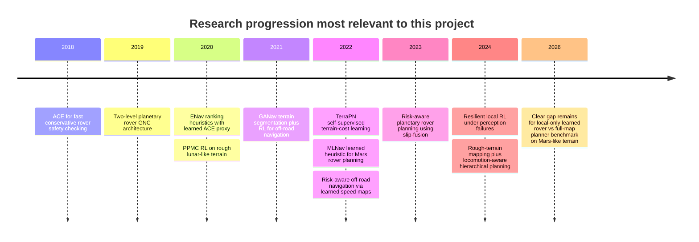
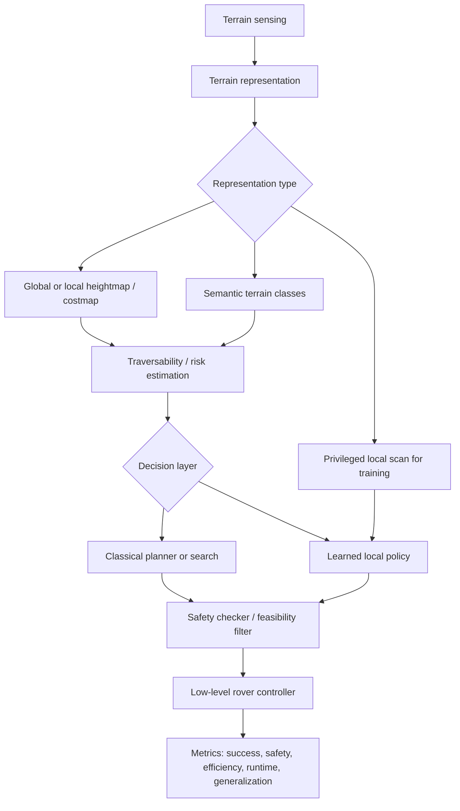

# Rigorous Literature Search for Learned and Planned Rough Terrain Navigation

## Executive summary

The uploaded project documents define a very specific target problem even though the user prompt described it as “unspecified”: a MuJoCo benchmark for **Mars-like rough-terrain navigation** that compares a **PPO policy using only local onboard sensing** against **classical planners such as Dijkstra and A\*** that have access to the **full terrain map**, with evaluation centered on **success rate, rollover safety, generalization to unseen terrain, and runtime**, not merely shortest-path optimality. Real Mars elevation data such as HiRISE patches are reserved for evaluation. fileciteturn0file0 fileciteturn0file1 fileciteturn0file2

The literature closest to that setup falls into three clusters. First, **planetary rover autonomy papers** such as ACE, ENav-related work, and rover GNC architectures focus on conservative safety checking, terrain-aware path ranking, and multi-level autonomy pipelines rather than end-to-end learned local control. ACE and the ENav/MLNav line are especially relevant because they encode the real constraint that rover planning is dominated by repeated safety checks under tight onboard compute budgets. citeturn30view1turn46view0turn46view5turn29view3

Second, **hybrid learning-enhanced planning papers** use machine learning to improve traversability estimation or trajectory ranking while preserving a model-based safety backstop. The strongest exemplars are the ENav heuristic paper, MLNav, and recent risk-aware rover path-planning work that fuses terrain classification and slip prediction into probabilistic traversal costs. These papers are highly relevant to your baseline design because they show where learning already helps in safety-critical rover stacks: not by replacing safety filtering wholesale, but by improving search efficiency and terrain-risk estimation. citeturn46view2turn46view5turn45view5turn45view6

Third, **direct learned local navigation and off-road rough-terrain work** shows that local reactive policies can perform strongly when global maps are missing, noisy, or partially wrong. The closest analogues are PPMC on rough lunar-like terrain, TerraPN, GANav, risk-aware off-road navigation via learned speed maps, and ETH’s resilient local navigation work, which specifically demonstrates that a learned local policy can outperform heuristic reactive planners under degraded perception while running in real time on CPU. citeturn45view0turn21view4turn21view7turn30view0turn45view8turn45view9turn45view10

The key synthesis is that **no paper I found exactly matches your proposed fairness protocol**: a learned **local-only** rover policy, evaluated head-to-head against a **full-information global-map planner** on **Mars-like rough terrain** with a verdict based primarily on **success, safety, generalization, and runtime**. That absence is important. It means your project is not merely “another rover RL paper”; it sits at the intersection of three mature lines of work without being directly pre-solved by any one of them. That also means your strongest literature-supported design move is to borrow the **evaluation discipline** of planetary autonomy papers and the **training / generalization discipline** of RL rough-terrain papers. This gap assessment is an inference from the set of papers below, not a direct quote from a single source. citeturn30view1turn46view0turn46view5turn29view3turn45view0turn30view0turn45view9

## Project framing and search protocol

I treated the project problem as: **Can a locally sensing, learned navigation policy for a rover match or beat a classical planner with privileged global terrain information when the task is rough-terrain Mars traversal rather than idealized shortest-path optimization?** That framing comes directly from the uploaded project description, thesis, and implementation plan. fileciteturn0file0 fileciteturn0file1 fileciteturn0file2

The literature search was conducted to match the scope you requested: peer-reviewed journals, conference proceedings, and arXiv/preprints as needed, with searches centered on IEEE-style robotics venues, ACM-oriented discovery paths, Google Scholar-style title matching, and targeted arXiv discovery. I prioritized original papers and official paper pages over secondary summaries. The screening logic included: rough-terrain navigation, rover or off-road mobility, local vs global planning, traversability estimation, risk-aware path planning, reinforcement learning for navigation, and empirical validation on simulation or physical robots. I excluded papers focused only on perception without navigation evaluation, pure manipulation/site-selection work, and unrelated planning domains.

One methodological caveat matters. Exact **citation counts** were **not reproducibly retrievable from primary or official sources in this session** without falling back to non-primary bibliometric pages whose values may drift or be inconsistently cached. Because you asked to prefer primary/original sources, I do **not** provide guessed counts. In the paper profiles below, I therefore mark citation count as **NV** for “not verifiable here,” and I point to arXiv paper pages that expose outbound Google Scholar, NASA ADS, and Semantic Scholar links for manual bibliometric verification if you want to enrich a final bibliography later. citeturn30view0turn30view1turn46view5

A final point about relevance: the planetary-navigation literature is smaller than the broader off-road and legged-robot navigation literature, so the report deliberately includes both **direct Mars/rover papers** and **near-neighbor rough-terrain local navigation papers**. That is the right move for your project, because your benchmark combines planetary autonomy, local sensing, policy learning, safety, and generalization in a way that no single subfield fully covers. citeturn46view5turn29view3turn45view0turn30view0turn45view9

## What the literature already solves

The most mature rover literature does **not** frame the problem as “RL versus Dijkstra.” Instead, it frames rover mobility as a **safety-critical planning problem under severe onboard compute limits**. ACE is the clearest example: it approximates body-terrain clearance, attitude, and suspension bounds conservatively so that a rover can reject unsafe trajectories without expensive iterative simulation, explicitly because repeated checking must run on spacecraft-class hardware such as RAD750. The ENav line then adds better cost heuristics and learned ranking to reduce the number of expensive ACE calls, which is exactly the sort of runtime-aware baseline discipline your project should inherit. citeturn30view1turn46view2turn46view3

A second line of work solves the problem by **keeping classical planning but making it more terrain-aware or more data-driven**. MLNav is the strongest representative: it augments ENav with a learned search heuristic, preserves a model-based safety checker, and reports a 10x reduction in collision checks on real Martian terrain data while succeeding in cases where baseline ENav times out. The 2023 risk-aware rover paper is also important because it explicitly models error in ML traversability prediction by fusing terrain classification and slip prediction into a multimodal risk distribution, then plans over that risk-aware cost. These papers do not answer your full benchmark question, but they show how planetary autonomy researchers currently trust learning: **as a contained module inside a conservative planner**. citeturn46view5turn46view7turn45view5turn45view6

The third line uses **learned local navigation** under rough or uncertain terrain. PPMC shows that RL can learn path planning and motion control on rough lunar-like terrain and generalize to unseen rough maps. TerraPN and GANav learn terrain properties or terrain semantics from interaction or perception and then improve navigation performance by producing better costmaps or traversability signals. ETH’s resilient local navigation paper is especially relevant to your thesis because it shows a learned local policy beating heuristic local planners when perception is degraded, using asymmetric actor-critic training, memory, PPO, and local terrain observations. Those are all design patterns that echo your own proposed setup. citeturn45view0turn21view4turn21view7turn30view0turn45view9turn41view2

The most important gap is therefore not that “there is no related work,” but that **the related work decomposes the problem differently**. Planetary rover papers emphasize conservative search and traversability analysis; rough-terrain RL papers emphasize local reactivity and robustness; off-road papers emphasize learned terrain costs. Your benchmark is distinctive because it **intentionally pits these assumptions against each other** under asymmetric information. That makes the project publishable-quality as a careful benchmark even if the final result is negative. That claim is my synthesis from the papers below. citeturn30view1turn46view5turn29view3turn45view0turn30view0turn45view9

The timeline shows a fairly clear progression: from **safe classical rover planning**, to **hybrid learning inside planning**, to **fully learned or highly learned local rough-terrain navigation**. What is still missing is your exact experimental framing. citeturn30view1turn29view3turn46view0turn45view0turn30view0turn46view5turn45view8turn45view9turn45view11

## Prioritized reading list

The ordering below is not “best paper first” in the abstract. It is the reading order I would use **before project start** so that the conceptual scaffolding builds correctly.

1. **Fast Approximate Clearance Evaluation for Rovers with Articulated Suspension Systems** — Kyohei Otsu, Guillaume Matheron, Sourish Ghosh, Olivier Toupet, Masahiro Ono; 2018; official Wiley DOI linked from the arXiv paper page. Start here because ACE explains why real rover autonomy is not just shortest-path search: repeated terrain-safety evaluation is the bottleneck. It gives you the operational logic behind a serious classical baseline and suggests how to design a fair “safety-aware” planner rather than a toy A\* baseline. citeturn30view1

2. **Machine Learning Based Path Planning for Improved Rover Navigation** — Neil Abcouwer et al.; 2020; arXiv preprint submitted to IEEE. Read this next because it shows how ENav actually ranks candidate paths and where learning helps without breaking safety guarantees. It is the cleanest bridge paper between classical rover autonomy and learned terrain reasoning. citeturn46view0turn46view2

3. **MLNav: Learning to Safely Navigate on Martian Terrains** — Shreyansh Daftry et al.; RA-L and ICRA 2022. This is the strongest directly relevant Mars paper in the set. It validates learned heuristics on real Martian terrain data from Perseverance, preserves safety through model-based checking, and reports a 10x reduction in collision checks. If your benchmark needs one “must cite” modern Mars paper, this is it. citeturn46view5turn46view7

4. **Risk-aware Path Planning via Probabilistic Fusion of Traversability Prediction for Planetary Rovers on Heterogeneous Terrains** — Masafumi Endo et al.; accepted at ICRA 2023. Read this to understand state-of-the-art thinking about uncertain traversability on planetary terrain, especially where learned slip prediction can be wrong. It matters if your classical baseline is meant to be strong on risky terrain rather than merely geometrically shortest. citeturn29view2turn45view5turn45view6

5. **A GNC Architecture for Planetary Rovers with Autonomous Navigation Capabilities** — Martin Azkarate et al.; ICRA 2020. This paper gives you a systems-level architectural picture: low-level efficient local navigation always on, higher-level traversability/SLAM triggered when terrain demands it. It is helpful for organizing your benchmark and for writing the baselines section of a future paper or portfolio write-up. citeturn29view3turn45view7

6. **PPMC RL Training Algorithm: Rough Terrain Intelligent Robots through Reinforcement Learning** — Tamir Blum and Kazuya Yoshida; 2020; arXiv. This is the cleanest “direct RL for rough-terrain rover-like mobility” paper in the set. It is more primitive than your target benchmark, but it is valuable because it explicitly targets generalization from one rough terrain to unseen maps. citeturn27view0turn45view0

7. **TerraPN: Unstructured Terrain Navigation using Online Self-Supervised Learning** — Adarsh Jagan Sathyamoorthy et al.; 2022; arXiv. This is useful if you want your project to mature from a privileged local height scan toward more realistic perceptual autonomy. It shows how terrain interaction can be turned into self-supervised training signals and then used for terrain-cost-aware navigation. citeturn21view4turn21view7turn29view6

8. **GANav: Efficient Terrain Segmentation for Robot Navigation in Unstructured Outdoor Environments** — Tianrui Guan et al.; 2021; arXiv. Read this if you want to understand the perception-rich successor to your v1 plan. It combines terrain segmentation with downstream RL navigation and reports empirical gains on standard off-road datasets and real robots. citeturn30view0

9. **Risk-Aware Off-Road Navigation via a Learned Speed Distribution Map** — Xiaoyi Cai et al.; 2022; arXiv. This is not planetary, but it is extremely relevant to cost shaping and traversability representation. It shows how learned speed distributions can be converted into CVaR-style risk-aware costmaps and yields a 30% success-rate improvement in a high-fidelity autonomy stack. citeturn28view5turn45view8

10. **Resilient Legged Local Navigation: Learning to Traverse with Compromised Perception End-to-End** — Jin Jin et al.; ICRA 2024; project page notes it was an ICRA finalist for Best Paper Award in Cognitive Robotics. Finish with this paper because it is the strongest evidence in the set that a learned local policy can beat classical local planners when map quality degrades. It is not a rover paper, but on the specific question of local reactivity under imperfect perception, it is highly transferable. citeturn45view9turn33view1turn41view2

## Comparison of methods

| Paper | Approach type | Data requirements | Evaluation setting | Reported performance signal | Reproducibility | Why it matters for your project |
|---|---|---|---|---|---|---|
| ACE | Conservative classical safety checker | Local heightmap plus rover geometry/suspension bounds | Mars 2020 rover path safety evaluation | Conservative clearance and attitude bounds with fast computation on constrained hardware | PDF available; no public code surfaced | Strongest template for a serious safety-aware classical baseline. citeturn30view1 |
| ENav heuristic paper | Hybrid classical planner with handcrafted and learned path-ranking heuristics | Heightmaps, ACE labels from physics sim | Monte Carlo trials over variable slopes and rocks | Fewer ACE evaluations, less computation time, better path efficiency, maintained or improved success | PDF available; no code surfaced | Shows where learned ranking helps before safety validation. citeturn46view0turn46view2 |
| MLNav | Learned search heuristic inside safety-critical Mars planner | Synthetic training terrains plus real Perseverance terrain data | High-fidelity simulation and real Mars data | 10x reduction in collision checks; succeeds where ENav times out | PDF available; no code surfaced | Closest direct Mars benchmark paper. citeturn46view5turn46view7 |
| Planetary risk-aware slip fusion | Risk-aware path planning with terrain-type and slip probabilistic fusion | ML terrain classification plus slip prediction | Heterogeneous-terrain rover simulation | More feasible paths than existing methods | PDF available; no code surfaced | Important if your classical planner should be more than geometric A\*. citeturn45view5turn45view6 |
| Planetary GNC architecture | Two-level rover autonomy stack | Hazard detection, VO, adaptive SLAM, traversability evaluation | Planetary analogue field tests | Long-range low-supervision rover navigation validated in field campaigns | DOI and PDF available; no code surfaced | Helpful architectural reference for baseline decomposition. citeturn29view3turn45view7 |
| PPMC RL | End-to-end RL for path planning and motion control | State, goals, waypoint curriculum, rough simulated maps | Wheeled rover on rough lunar-like terrain | 100% success on unseen rough maps in reported experiments | PDF available; no code surfaced | Closest rough-terrain rover RL precursor. citeturn27view0turn45view0 |
| TerraPN | Self-supervised terrain-cost learning plus planner | RGB terrain images, velocities, IMU vibration, odometry error | Multiple outdoor surfaces | Up to 35.84% higher success, 21.52% lower vibration cost | PDF available; no code surfaced | Strong design pattern for learning from proprioceptive interaction. citeturn21view4turn21view7turn29view6 |
| GANav | Terrain segmentation plus downstream RL navigation | RGB images; RUGD and RELLIS-3D datasets | Simulation plus Jackal and Husky robots | mIoU gains; +10% success; lower roughness; lower false positives | Public code/report page referenced | Most useful if v2 adds richer perception. citeturn30view0 |
| Learned speed distribution map | Risk-aware off-road costmap learning | Experienced trajectories with semantics and commanded speed | Simulation plus high-fidelity Unity autonomy stack | Faster time-to-goal and 30% higher success rate | PDF available; no code surfaced | Excellent inspiration for risk-aware terrain cost design. citeturn28view5turn45view8 |
| Resilient local navigation | PPO-based local navigation under corrupted perception | Traversability maps, sampled terrain heights, proprioception, memory | Simulation plus real ANYmal | >30% higher success vs heuristic local planners under perception failures | Project page and videos public; code not surfaced | Best evidence for local learned robustness when maps are wrong. citeturn45view9turn33view1turn41view2 |

A common solution pipeline in this literature looks like this:

The flowchart highlights a design choice your project makes explicit: most prior work either routes through **classical planning with improved costs/heuristics** or through a **learned local policy**, whereas your benchmark asks those two design philosophies to compete under different information assumptions. citeturn30view1turn46view5turn30view0turn45view9

## Detailed paper profiles

**Fast Approximate Clearance Evaluation for Rovers with Articulated Suspension Systems — Otsu, Matheron, Ghosh, Toupet, Ono; 2018; official Wiley publication linked from arXiv.**  
**Abstract gist:** a lightweight, conservative body-terrain clearance evaluator for Mars 2020 rover planning. **Problem statement:** repeated safety checks over uneven terrain are too expensive for spacecraft-class computers. **Methods:** ACE estimates lowest and highest possible wheel heights, then computes conservative bounds on belly clearance, attitude, and suspension angles without iterative nonlinear optimization. **Data / evaluation:** automated path planning for Mars 2020 rover terrain scenarios. **Metrics / results:** fast computation with conservative safety guarantees. **Strengths:** operational realism; directly relevant to rover safety. **Limitations:** not a learned controller and not a full traversal benchmark by itself. **Code/data:** PDF available through the paper page; no public code surfaced. **Citation count:** NV. **Relevance:** essential for designing a serious classical baseline and for understanding why a naïve shortest-path comparison is not enough. citeturn30view1

**Machine Learning Based Path Planning for Improved Rover Navigation — Abcouwer, Daftry, Venkatraman, del Sesto, Toupet, Lanka, Song, Yue, Ono; 2020; arXiv preprint submitted to IEEE.**  
**Abstract gist:** ENav’s candidate-path ranking is improved by a hand-designed gradient heuristic and an ML heuristic that predicts ACE-untraversable areas. **Problem statement:** ENav wastes time on poorly ranked candidate paths that later fail expensive ACE checks. **Methods:** Sobel/convolution-based terrain-gradient cost plus an ML classifier trained on heightmaps labeled by physics-simulated ACE results. **Data / evaluation:** Monte Carlo trials on terrains with different slopes and rock distributions. **Metrics / results:** reduced ACE evaluations and planning-cycle time, better path efficiency, and maintained or improved successful traverses. **Strengths:** very clear intervention point in a real rover stack. **Limitations:** still planner-centric, not a direct learned policy. **Code/data:** PDF available; no public code surfaced. **Citation count:** NV. **Relevance:** perhaps the single best paper for designing a strong planner-side baseline against which your PPO policy should compete. citeturn46view0turn46view2turn46view3

**MLNav: Learning to Safely Navigate on Martian Terrains — Daftry, Abcouwer, Del Sesto, Venkatraman, Song, Igel, Byon, Rosolia, Yue, Ono; 2022; IEEE Robotics and Automation Letters and ICRA 2022.**  
**Abstract gist:** a learning-enhanced Mars planner that predicts promising trajectories while retaining model-based safety checking. **Problem statement:** collision checking dominates compute in safety-critical rover navigation, especially on complex terrain. **Methods:** learned proxy collision heuristic within a search-based planner; safety preserved by the model-based checker. **Data / evaluation:** high-fidelity simulation, synthetic terrains, and real Martian terrain data collected by Perseverance. **Metrics / results:** 10x fewer collision checks on real Martian terrain and success in terrains where baseline ENav timed out. **Strengths:** strongest Mars-specific modern result; safety-preserving. **Limitations:** still not a direct local-control RL policy. **Code/data:** PDF available; no public code surfaced. **Citation count:** NV. **Relevance:** mandatory citation for the Mars/autonomy section of your project and a benchmark-quality reference for evaluation methodology. citeturn46view5turn46view7

**Risk-aware Path Planning via Probabilistic Fusion of Traversability Prediction for Planetary Rovers on Heterogeneous Terrains — Endo, Taniai, Yonetani, Ishigami; 2023; accepted for ICRA 2023.**  
**Abstract gist:** path planning over heterogeneous terrain should explicitly model error in learned traversability prediction. **Problem statement:** erroneous slip/traversability predictions can immobilize a rover on deformable or mixed terrain. **Methods:** probabilistic fusion of terrain-type classification and slip prediction into a multimodal slip distribution, then derivation of risk-aware path costs. **Data / evaluation:** simulation experiments on heterogeneous terrains. **Metrics / results:** generated more feasible paths than existing methods. **Strengths:** formally acknowledges uncertainty in learned terrain models. **Limitations:** no direct local-policy benchmark and limited public reproducibility evidence surfaced. **Code/data:** PDF available; no public code surfaced. **Citation count:** NV. **Relevance:** excellent reference if you want the classical side of your benchmark to be risk-aware rather than simplistic. citeturn29view2turn45view5turn45view6

**A GNC Architecture for Planetary Rovers with Autonomous Navigation Capabilities — Azkarate, Gerdes, Joudrier, Pérez-del-Pulgar; 2020; ICRA 2020.**  
**Abstract gist:** a two-level rover autonomy stack with always-on efficient navigation and an upper level for richer traversability/SLAM reasoning. **Problem statement:** future planetary rovers need longer, faster traverses with limited supervision. **Methods:** low-level hazard detection, local replanning, visual odometry; high-level adaptive SLAM, traversability evaluation, global localization. **Data / evaluation:** planetary analogue field campaigns. **Metrics / results:** validated multi-level architecture for fast, low-supervision exploration. **Strengths:** systems realism and architectural clarity. **Limitations:** not a head-to-head learning paper. **Code/data:** DOI and PDF available; no public code surfaced. **Citation count:** NV. **Relevance:** strong reference for how to decompose your own classical baseline and how to write the “related systems” section. citeturn29view3turn45view7

**PPMC RL Training Algorithm: Rough Terrain Intelligent Robots through Reinforcement Learning — Blum and Yoshida; 2020; arXiv.**  
**Abstract gist:** a generic RL training algorithm for path planning and motion control on rough terrain, demonstrated on a wheeled rover. **Problem statement:** robots operating without perfect prior environmental knowledge need to generalize across rough terrain. **Methods:** waypoint-based episodic RL with a single network learning both goal-directed motion and motor control; rough-map curriculum on a four-wheeled rover resembling lunar exploration conditions. **Data / evaluation:** one training map and unseen rough maps. **Metrics / results:** reported retention of 100% success on unseen rough terrain maps. **Strengths:** direct rough-terrain rover RL and generalization focus. **Limitations:** limited evaluation scope, no direct comparison to strong global planners, and less realistic planetary system integration than ENav/MLNav. **Code/data:** PDF available; no public code surfaced. **Citation count:** NV. **Relevance:** closest prior art to a pure learned-navigation rover baseline. citeturn27view0turn45view0turn45view2

**TerraPN: Unstructured Terrain Navigation using Online Self-Supervised Learning — Sathyamoorthy, Weerakoon, Guan, Liang, Manocha; 2022; arXiv.**  
**Abstract gist:** terrain costs can be learned from robot-terrain interactions instead of hand labels. **Problem statement:** outdoor navigation requires knowing traction, bumpiness, and deformability, but those are hard to annotate manually. **Methods:** RGB plus robot velocity as inputs; IMU vibration and odometry error as self-supervision; non-uniform terrain patch sampling; cost-aware trajectory generation. **Data / evaluation:** multiple outdoor surfaces in robot-navigation scenarios. **Metrics / results:** up to 35.84% higher success, 21.52% lower vibration cost, and 47.27% lower inference time relative to uniform sampling and prior segmentation-based approaches. **Strengths:** elegant self-supervision and strong transfer value for future sensor-realistic versions of your project. **Limitations:** not Mars-specific and not planner-vs-policy in your exact sense. **Code/data:** PDF available; no public code surfaced. **Citation count:** NV. **Relevance:** very useful for shaping v2 if you eventually replace privileged scans with more realistic onboard sensing. citeturn21view4turn21view6turn21view7turn29view6

**GANav: Efficient Terrain Segmentation for Robot Navigation in Unstructured Outdoor Environments — Guan, Kothandaraman, Chandra, Sathyamoorthy, Weerakoon, Manocha; 2021; arXiv.**  
**Abstract gist:** efficient semantic terrain segmentation can improve downstream RL navigation in unstructured outdoor environments. **Problem statement:** off-road navigation benefits from semantic discrimination among terrain classes with different navigability. **Methods:** group-wise attention loss for coarse terrain segmentation, then integration with deep RL navigation. **Data / evaluation:** RUGD and RELLIS-3D datasets plus Clearpath Jackal and Husky experiments. **Metrics / results:** mIoU improvements on both datasets, about 10% better success rate, lower trajectory roughness, and lower false positives for forbidden regions. **Strengths:** unusually complete chain from perception to navigation to real-robot deployment; public code/report page referenced. **Limitations:** not planetary and not directly about local-only rover policies on heightmaps. **Code/data:** public code/videos/technical report referenced from the paper page. **Citation count:** NV. **Relevance:** strongest “perception-rich successor” reference for your deferred student-policy / camera-based phase. citeturn30view0

**Risk-Aware Off-Road Navigation via a Learned Speed Distribution Map — Cai, Everett, Fink, How; 2022; arXiv.**  
**Abstract gist:** traversability is better represented as a distribution over achievable speed than as a simple semantic class. **Problem statement:** off-road planning needs to reason about both geometry and semantics, plus uncertainty in how fast different terrain can actually be traversed. **Methods:** learned speed distribution conditioned on environment semantics and commanded speed; conversion to risk-aware costmaps using CVaR. **Data / evaluation:** numerical simulation and a high-fidelity Unity autonomy stack. **Metrics / results:** faster time-to-goal against expectation-only planning and 30% better navigation success. **Strengths:** interpretable risk-based cost design. **Limitations:** not planetary and not a direct RL-vs-planner comparison. **Code/data:** PDF available; no public code surfaced. **Citation count:** NV. **Relevance:** very strong inspiration for cost shaping and “safety-aware path efficiency” analysis in your classical baseline. citeturn28view5turn45view8

**Resilient Legged Local Navigation: Learning to Traverse with Compromised Perception End-to-End — Jin, Zhang, Frey, Rudin, Mattamala, Cadena, Hutter; 2024; ICRA 2024.**  
**Abstract gist:** when perception is corrupted, a learned local policy can recover where classical local planners fail. **Problem statement:** local planners built on inaccurate maps get stuck on invisible obstacles and pits. **Methods:** PPO-trained high-level local navigation policy over a low-level locomotion controller, asymmetric actor-critic, LSTM memory, corrupted traversability maps, local height scans, proprioception, and privilege-based critic inputs. **Data / evaluation:** simulation plus real ANYmal robot; project page reports ICRA 2024 and finalist status. **Metrics / results:** more than 30% higher success than heuristic local planners under perception failures and real-time CPU inference. **Strengths:** best evidence in the set for the value of learned local reactivity under map corruption. **Limitations:** legged, not wheeled, and compares against local heuristics rather than privileged global-map planners. **Code/data:** project page and videos are public; code not surfaced in the accessible sources. **Citation count:** NV. **Relevance:** conceptually the most supportive paper for your central thesis, even though the embodiment differs. citeturn45view9turn45view10turn33view1turn41view2

**Bipedal Safe Navigation over Uncertain Rough Terrain: Unifying Terrain Mapping and Locomotion Stability — Muenprasitivej, Jiang, Shamsah, Coogan, Zhao; 2024; arXiv.**  
**Abstract gist:** terrain uncertainty and locomotion stability should be planned jointly, not treated as separate modules. **Problem statement:** uncertain terrain elevation causes both traversability uncertainty and motion perturbation. **Methods:** Gaussian-process terrain learning, learned motion-deviation modeling, and hierarchical locomotion-dynamics-aware planning with information-gain-aware trajectory evaluation. **Data / evaluation:** Digit biped simulation in MuJoCo. **Metrics / results:** paper emphasizes efficacy of a hierarchical planner that respects rough-terrain locomotion constraints. **Strengths:** excellent systems view of rough-terrain navigation under uncertainty, and strong MuJoCo relevance. **Limitations:** not rover-specific and not a direct learned local-controller benchmark. **Code/data:** PDF available; no public code surfaced. **Citation count:** NV. **Relevance:** useful if your later evaluation needs to explain why navigation and vehicle stability should be considered together rather than as separate afterthoughts. citeturn45view11turn45view12turn45view13

## Synthesis for project design

The literature suggests that your project should **not** set up the baseline as “plain grid A\* versus PPO” and call it finished. A competent classical planetary baseline should combine at least three ingredients: a traversability-aware cost over the heightmap, a search procedure such as Dijkstra/A\* or a candidate-trajectory tree, and a safety evaluator that rejects geometrically short but dynamically unsafe routes. ACE and the ENav/MLNav line show exactly why this matters: planning cost is dominated by checking whether a candidate traversal is feasible for a rover body with suspension and rollover risk, not merely by graph search itself. citeturn30view1turn46view0turn46view5

On the learned-policy side, the most portable lessons are: use **curriculum**, **domain randomization**, **safety penalties**, and **privileged training signals only where clearly justified**. PPMC emphasizes generalization across unseen rough maps; TerraPN and GANav show the value of learning terrain consequences from interaction or perception; the resilient local-navigation paper demonstrates that privileged training plus imperfect test-time perception can produce robust local behavior. Those are all directly compatible with your proposed v1/v2 split between privileged local terrain scans and later camera-based student policies. citeturn45view0turn21view4turn30view0turn41view2

For evaluation, the literature strongly supports the metric choices already present in your project documents: **success rate, safety/failure or rollover rate, path efficiency, generalization, and runtime**. What the rover papers add is a warning that runtime should be measured not only as wall-clock per episode but as **planning burden**: number of expensive safety checks, overthinking frequency, replanning latency, or episodes where the planner fails to return a feasible solution in time. Meanwhile, the RL and off-road papers suggest adding terrain-smoothness or vibration-style proxies if you later want a more mobility-realistic notion of traversal quality. fileciteturn0file0 fileciteturn0file1 fileciteturn0file2 citeturn46view0turn46view5turn21view7turn45view8

The biggest literature-backed opportunity is that your exact benchmark remains open. The rover-planning papers suggest a strong classical planner should win on **path optimality and trusted-map exploitation**; the learned local-navigation papers suggest a trained policy may win on **reactivity, constant-time inference, and graceful degradation under missing or corrupted map information**. Because your project documents already define “better” in terms of success, safety, generalization, and runtime rather than raw shortest path, the benchmark is scientifically meaningful even if the final answer is “the planner still wins.” A clean negative result would still fill a real gap in the literature. That is the clearest overall conclusion from this search. fileciteturn0file1 citeturn30view1turn46view5turn45view9turn33view1